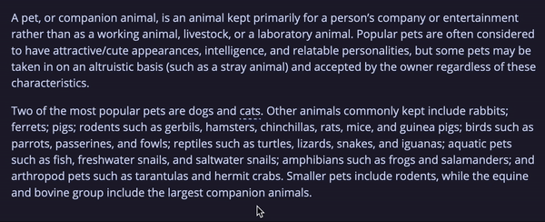

# mdbook-hints
mdBook preprocessor to add hover hints (tooltips) to your book. Markdown is supported.



## Usage
1. Install the binary using `cargo install mdbook-hints` command
2. Copy `hints.css` and `hints.js` from `/theme/` to the book's `/theme/` directory
3. Update `additional-css` and `additional-js` within the `book.toml` as shown below
```diff
[output.html]
-additional-css = []
+additional-css = ["./theme/hints.css"]

-additional-js = []
+additional-js = ["./theme/hints.js"]
```
4. Add following line in `book.toml`
```toml
[preprocessor.hints]
```
5. Add following lines to the `/theme/index.hbs` file before the custom JS scripts
```html
<!-- Here -->
<script src="https://unpkg.com/@popperjs/core@2"></script>
<script src="https://unpkg.com/tippy.js@6"></script>

<!-- Custom JS scripts -->
```
6. Create `hints.toml` file in the book root directory (same location where the `book.toml` lives)

Now you can your hints:
```toml
# hints.toml
[cat]
hint = "A cat is a small, independent, domesticated feline known for its playful and sometimes mysterious nature. *meow*"
```
```md
<!-- my-chapter.md -->
My friend has a [kitty](~cat) with 4 legs.
```

Adding `!` after the `~` symbol will make the hint disappear (only the hint, text in `[]` brackets will still be shown)
```md
[this pizza hint won't show](~!pizza)
```

If you specify a hint in the markdown but it won't be present in `hints.toml`, the hint will be ignored but text in `[]` brackets will still be shown (same as `[](~!ignored)`)
```sh
$ mdbook build
2024-08-08 20:03:53 [INFO] (mdbook::book): Book building has started
-----
Hint for `non-existent-hint` (general/main.md) is missing in hints.toml!
-----
2024-08-08 20:03:53 [INFO] (mdbook::book): Running the html backend
```

> [!NOTE]  
> The markdown is converted into unescaped HTML so only trusted users should have access to the `hints.toml` file. If you want to disable HTML support for tooltips which will break markdown comments, you can do that in `/theme/index.js`.

## How it works / How to customize
The preprocessor itself just wraps the text into span with _hint_ class and _hint_ attribute with value of the identifier and create `hints.json` file in the `/src/` directory.
So this input
```md
[meow meow meow](~cat)
```
Generates following HTML
```html
<span class="hint" hint="cat">meow meow meow</span>
```
Everything else is managed by the `/theme/hints.js` using [Tippy.js](https://atomiks.github.io/tippyjs/) library added in the `/theme/index.hbs` file. Styles are defined in the `/theme/hints.css` file.

## TODO
- [ ] automatically hint specified words
- [ ] add support for custom classes